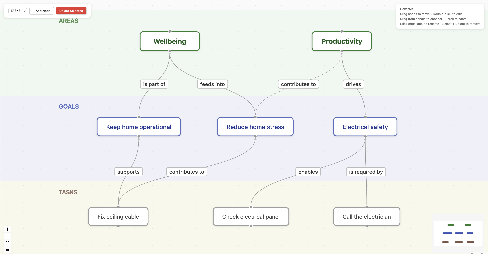

# Swimlanes Goal Editor

A modern, interactive **swimlane visualization** for mapping goals, objectives, and tasks — built with React Flow.




## What is this?

A fully interactive canvas where you can visually organize your **Areas**, **Goals**, and **Tasks** in horizontal swim lanes — then draw labeled connections between them to express how work flows upward toward your big-picture objectives.

Think of it as a visual strategy board: tasks at the bottom feed into goals, goals roll up into life/work areas at the top.

## Features

- **Drag & Drop** — Move nodes freely across the canvas
- **Zoom & Pan** — Scroll to zoom, drag the canvas to navigate
- **Labeled Connections** — Click any edge label to assign a relationship type from a fixed vocabulary (`supports`, `enables`, `drives`, `is part of`, etc.)
- **Inline Editing** — Double-click any node to rename it
- **Create Nodes** — Add new areas, goals, or tasks with one click
- **Snap to Grid** — Clean, aligned layouts without effort
- **MiniMap** — Always know where you are in the canvas
- **Semantic Edges** — Labels read naturally bottom-to-top (e.g., *"Fix ceiling cable* **supports** *Keep home operational"*)

## Quick Start

```bash
git clone git@github.com:papesce/swimlanes-eval.git
cd swimlanes-eval
npm install
npm run dev
```

Open [http://localhost:5173](http://localhost:5173) and start building your goal map.

## How It Works

The editor uses three swim lanes stacked vertically:

| Lane | Purpose | Example |
|------|---------|---------|
| **AREAS** | High-level life/work domains | Wellbeing, Productivity |
| **GOALS** | Measurable objectives | Keep home operational, Electrical safety |
| **TASKS** | Concrete actions | Fix ceiling cable, Call the electrician |

Connections flow **bottom-to-top** with semantic labels:

```
[Task] ──supports──▶ [Goal] ──is part of──▶ [Area]
```

## Connection Labels

Click the label badge on any edge to pick from:

| Label | Meaning |
|-------|---------|
| supports | Directly helps achieve the target |
| contributes to | Partially helps (indirect) |
| enables | Makes the target possible |
| is part of | A subset of the target |
| is required by | The target cannot proceed without this |
| drives | Primary force behind the target |
| feeds into | Outputs flow into the target |
| conflicts with | Works against the target |

## Tech Stack

| Layer | Technology |
|-------|-----------|
| Framework | React 19 + TypeScript |
| Graph Engine | [React Flow (xyflow)](https://github.com/xyflow/xyflow) |
| Build Tool | Vite 8 |
| Styling | Inline styles (zero dependencies) |

## Project Structure

```
src/
├── components/
│   ├── GoalEditor.tsx       # Main canvas, state, and interactions
│   ├── GoalNode.tsx         # Custom node component (styled per lane)
│   ├── LabeledEdge.tsx      # Custom edge with clickable label
│   ├── EdgeLabelPicker.tsx  # Dropdown picker for edge labels
│   └── LaneBackground.tsx   # Colored swim lane backgrounds
├── App.tsx                  # App shell
├── main.tsx                 # Entry point
└── index.css                # Global reset
```

## Extending

- **Add more lanes** — Edit the `LANES` array in `GoalEditor.tsx`
- **Custom label vocabulary** — Edit `EDGE_LABELS` in `LabeledEdge.tsx`
- **Persist state** — Wire up `nodes`/`edges` state to localStorage, a database, or an API
- **Auto-layout** — Integrate [elkjs](https://github.com/kieler/elkjs) or [dagre](https://github.com/dagrejs/dagre) for automatic node positioning

## License

MIT
